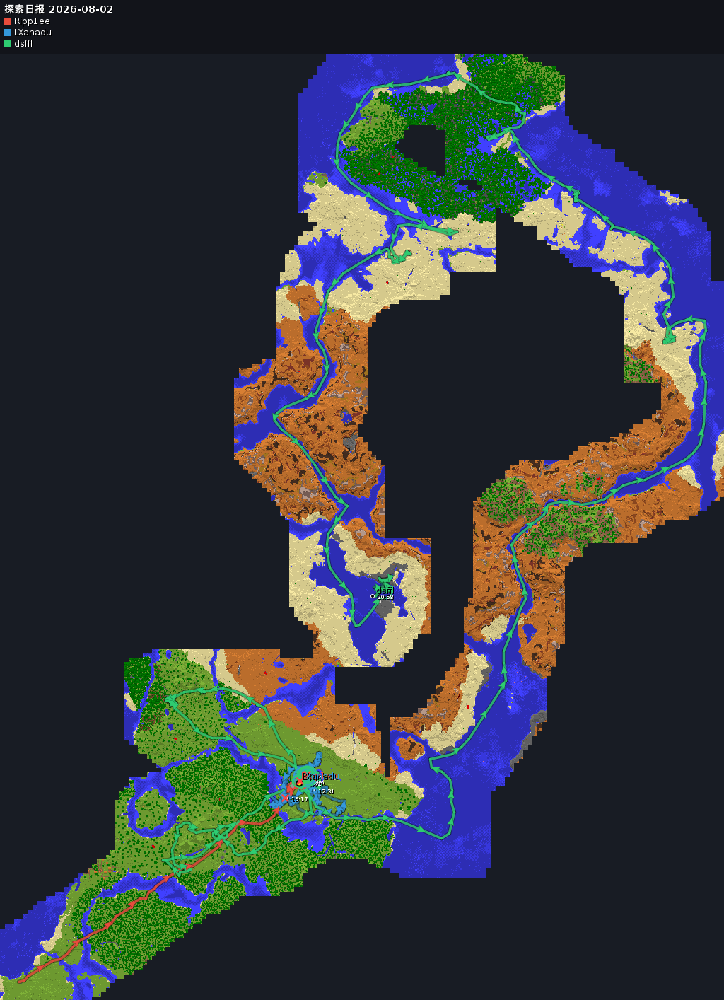

# McQqBridge

MC 服务器 <-> QQ 群双向聊天互通插件（Paper），基于 QQ 官方机器人 API，纯 Java 实现，无第三方框架依赖。

## 功能

**聊天互通**
- QQ 群消息（含 @机器人）-> 游戏内聊天；游戏内聊天 -> QQ 群
- 图片/表情消息以 `[图片/表情消息]` 占位显示
- full 模式额外转发进服/退服/死亡（含死因）/成就系统消息

**每日日报**
- 每天定时推送到绑定群：一段文字总结 + 探索地图（PNG）
- 文字总结由 DeepSeek AI 生成，失败自动降级为固定格式文本；涵盖在线时长、聊天、死亡、击杀、行走距离、停留等当日数据
- 探索地图按玩家视距增量渲染地形底图（新建筑/挖掘自动更新），叠加轨迹、停留圈、死亡/成就标记；支持主世界与下界，当日有下界活动时额外推送下界图
- 全量原版统计（挖掘/放置/合成等）每日汇总落盘，可供 AI 分析

**效果展示：**

<p align="center">
  
</p>

## 指令

控制台与游戏内均可使用，全部支持 Tab 补全。除 `status` 外均需 `mcqq.admin` 权限（OP 与控制台默认拥有）。未标注的配置修改后立即生效；标注「重启」的会立即写入 config.yml，重启服务器后生效。

```
/mcqq status                             查看当前状态与全部配置
/mcqq mode <chat|full>                   切换桥接模式
/mcqq bridge <mc2qq|qq2mc> <on|off>      开关转发方向
/mcqq format <mc|qq> <格式文本>           设置转发格式（占位符 {player}/{nickname} {message}）
/mcqq bind <openid> | unbind             手动绑定/解除 QQ 群（默认自动绑定）
/mcqq report now | toggle                立即生成日报 / 开关每日日报
/mcqq report time <HH:MM>                修改日报时间（重启）
/mcqq report retention <天数>             修改数据保留天数（重启）
/mcqq map <maxwidth|padding> <数值>       地图最大宽度（像素）/ 边距（格）
/mcqq trail <interval|stay> <秒>          轨迹采样间隔 / 停留判定阈值（重启）
/mcqq terrain <on|off>                   地形底图开关（重启）
/mcqq ai <enable|disable|model|baseurl|apikey|timeout> [值]   AI 总结设置（重启）
/mcqq qq <appid|appsecret> <值>           QQ 机器人凭据（重启）
/mcqq reload                             从磁盘重新加载配置
```

| 模式 | 行为 |
|------|------|
| `chat` | 只转发聊天消息（默认） |
| `full` | 聊天 + 进服/退服/死亡/成就系统消息 |

## 构建

需要 JDK 21+ 和 Maven 3.11+。

```bash
mvn package
# 产物: target/mc-qq-bridge-1.1.0.jar
```

## 部署

1. **先停服，再替换 jar，再启动**（运行中覆盖 jar 会导致类加载失败与数据保存中断）
2. 将 jar 放入服务器 `plugins/` 目录，启动一次自动生成配置（或手动复制 `src/main/resources/config.yml`）
3. 填入 QQ 机器人 AppID 和 AppSecret（也可用 `/mcqq qq appid|appsecret` 设置后重启）
4. 重启服务器

日报地图为插件自渲染，无需外部底图。服务器需安装中文字体（如 `fontconfig` + `wqy-microhei-fonts`），否则地图上的中文标签显示为方块。

## 配置

所有配置项也可通过上述指令在游戏内修改。首次运行生成的 `config.yml`：

```yaml
qq:
  app-id: "你的AppID"
  app-secret: "你的AppSecret"
  group-openid: ""       # 留空自动绑定，或手动填写群ID
bridge:
  mode: chat             # chat = 只发聊天 | full = 聊天 + 系统消息
  mc-to-qq: true
  qq-to-mc: true
  mc-format: "[MC] <{player}> {message}"
  qq-format: "[QQ] <{nickname}> {message}"
report:
  enabled: true
  time: "23:00"          # 每日推送时间
  retention-days: 30     # 日报数据保留天数
  map:
    max-width: 1024      # 地图最大宽度（像素）
    padding: 64          # 轨迹外边距（格）
  trail:
    time-threshold-sec: 5    # 轨迹采样间隔（秒）
    stay-threshold-sec: 30   # 视为停留的最小间隔（秒）
  ai:
    enabled: true
    base-url: "https://api.deepseek.com"
    api-key: ""          # 留空则使用固定格式文本
    model: "deepseek-v4-flash"
    timeout-sec: 60
  terrain:
    enabled: true        # 地形底图（视距增量渲染）
```

## QQ 开放平台注意事项

- 群内非 @ 消息需在开放平台开启「接收所有消息」
- 主动消息需群成员开启「允许主动发送」，否则报错 40034105
- 被动回复（带 `msg_id`）5 分钟内有效，每条消息最多回复 5 次
- 群图片须先上传（`file_data` base64）换取 `file_info`，再以 `msg_type=7` 富媒体发送

## 已知限制

- 成就标题转发到 QQ 为英文（服务端无语言文件）
- QQ 图片/表情无法在游戏内渲染，仅占位显示
- 末地暂不支持地图，末地轨迹不入图
- 末影珍珠/紫颂果瞬移不记断点，轨迹直接连线
- 日报地图中文标签依赖服务器中文字体

## 实现概要

- QQ 通信基于 JDK 内置 WebSocket/HttpClient，token 自动刷新、断线指数退避重连；地图渲染用 JDK AWT（headless），无外部依赖
- 日报数据落盘 `plugins/McQqBridge/data/`：每 30 分钟自动保存 + 关机兜底 + 启动恢复当天记录，正常重启不丢数据
- 地形瓦片落盘 `plugins/McQqBridge/map/tiles/`，增量渲染，重启后不重复渲染
